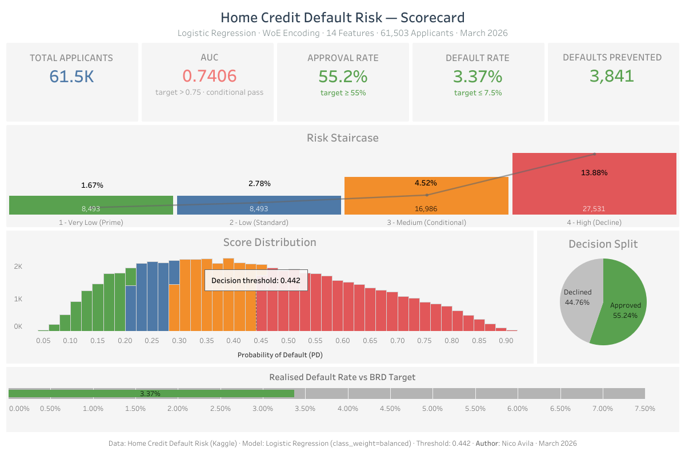
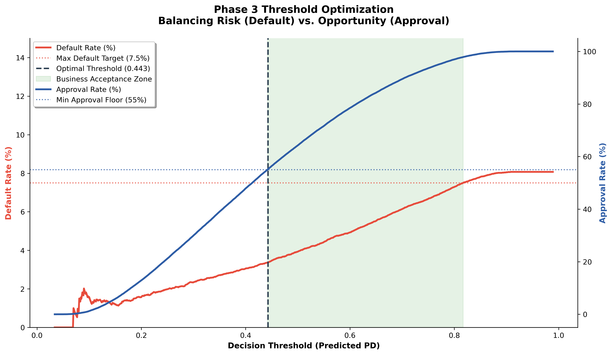
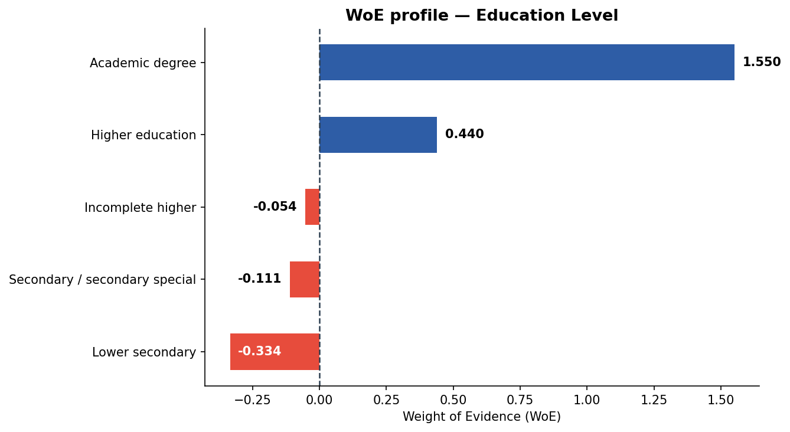
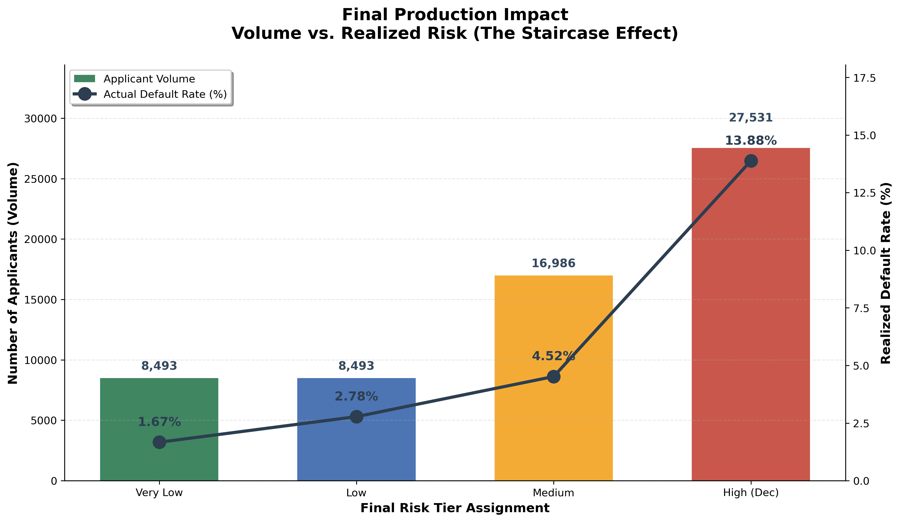

# Credit Risk Scorecard Framework

**2025**

A Probability of Default (PD) logistic regression model utilizing Weight of Evidence (WoE) encoding to reduce portfolio default rates by 58% while protecting approval volume.

## The Challenge
A digital lender was bleeding capital through an 8.1% loan default rate across 300,000+ applications. Because of their strict 10% profit margin, every single default wiped out the revenue of ten successful loans—meaning the business had to originate volume equivalent to 80% of its portfolio just to recover existing losses. The root cause was a fully manual, inconsistent review process that couldn't systematically identify high-risk applicants before approval. They needed a rigorous, data-driven scoring framework to stop the bleeding without tanking their origination pipeline.

### The Solution
I developed a Probability of Default (PD) scorecard built in Python, transitioning the business from manual reviews to an automated, end-to-end predictive analytics pipeline.

### Key Technical Implementations:
* **Data Engineering:** Cleaned and processed over 300k records using Pandas, directly addressing severe class imbalance (91.9% vs 8.1%) via stratified sampling and class weighting.
* **Feature Engineering:** Applied Weight of Evidence (WoE) encoding to linearize relationships. Evaluated Information Value (IV) to narrow 122 raw variables down to 14 highly predictive signals, integrating external bureau scores with applicant demographics and behavioral data.
* **Predictive Modeling:** Trained and validated a classification model across three iterative phases. I deliberately selected **Logistic Regression** over black-box models to ensure full interpretability, which is strictly required for regulatory compliance and Adverse Action notices.
* **Threshold Optimization:** Translated the machine learning outputs into a traditional 4-tier risk scorecard.

*Caption: This optimization analysis confirmed a decision threshold of 0.442 simultaneously satisfied both portfolio default rate constraints (≤ 7.5%) and approval rate targets (≥ 55%).*

## Key Analytical Insights

**The Education Signal:** Applicants with lower secondary education defaulted at 6x the rate of those with higher academic degrees.

*Caption: A deep dive into education as a predictor—Lower Secondary applicants represented the single strongest categorical signal for default in the entire dataset.*

* **The Fairness Flag:** The model identified that male applicants defaulted at a 44% higher relative rate than females. I explicitly flagged this CODE_GENDER feature for legal and compliance review before production deployment to prevent algorithmic bias.
* **Bureau over Demographics:** External bureau scores proved to be over 3x more predictive than any application-time feature like age or employment tenure.

## The Impact
By moving from manual reviews to a data-driven model, I prioritized portfolio safety while maintaining origination growth. By setting an optimized decision threshold at 0.442, the model achieved powerful risk segregation across four distinct tiers, demonstrating what lenders call "The Staircase Effect" in risk assessment.

This final scorecard achieved strong predictive separation and successfully **reduced the portfolio default rate from 8.1% to a safe 3.37%**—a massive 58% reduction in credit losses. Crucially, by identifying and declining the 'High' risk tier (13.88% default rate), the business was able to protect their healthy portfolio (Tiers 1-3) while maintaining a necessary **55.2% overall approval rate**, keeping origination targets on track.

## Links & Resources
* 

* 

* 