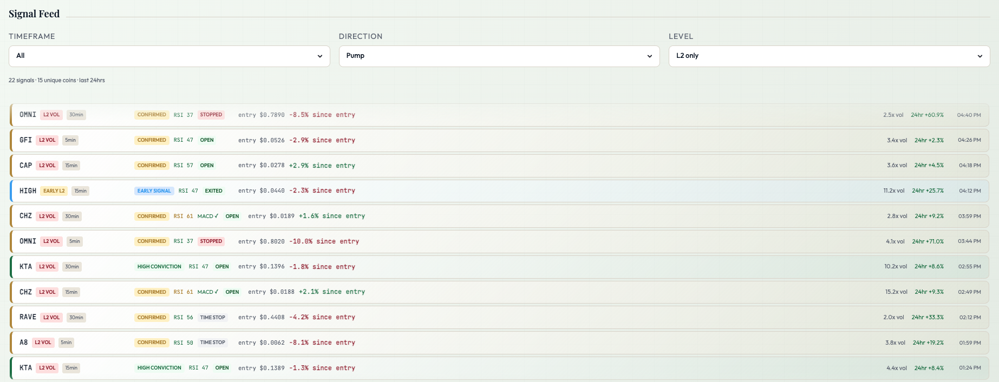
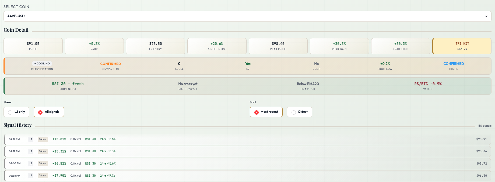
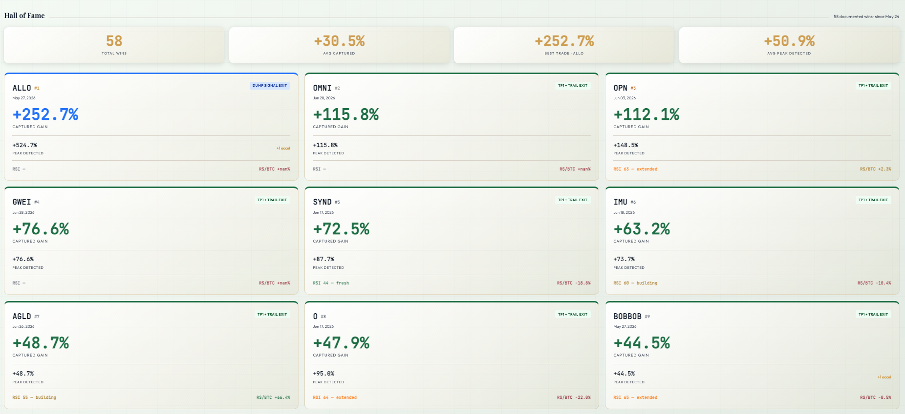

> ⚠️ **Disclaimer:** This project is a personal engineering and data science project built for educational and portfolio purposes only. Nothing on this page, the live dashboard, or the Telegram channel constitutes financial or investment advice. All performance data reflects signal detection outcomes — not actual trading results. Crypto markets are highly volatile. Never invest more than you can afford to lose.

# Momentum — Crypto Signal Tracker

**2026 · Active**

A 24/7 automated momentum detection and position management system scanning 231 Coinbase USD pairs every 7 minutes, fusing 6 independent signal types into a Unified Momentum Score, and managing trade exits automatically from entry through close.

## The Challenge

By the time a crypto pump is visible on a chart, the best entry is already gone. Volume confirmation — the signal most tools wait for — typically arrives after 15–30% of the move has already happened. Coinbase lists 231+ active USD pairs. Manually monitoring even 20 of them for early signals is impossible in real time. Simple volume spike alerts generate enormous false positive rates without multi-signal confirmation, and even when you catch the right coin, no automated exit system exists — gains evaporate.

## The Solution

I built a fully automated momentum detection engine that runs 24/7 on Railway, scanning all 231 Coinbase USD pairs across 4 timeframes every 7 minutes. The system fuses 6 independent signal types into a single 0–100 confidence score, fires Telegram alerts when volume confirms momentum, and manages positions automatically through 5 exit types — with every profitable exit auto-logged to a permanent Hall of Fame.

Live L2 alerts are published in real time to a public Telegram channel at [t.me/MomentumAlphaSignals](https://t.me/MomentumAlphaSignals) — every alert includes the Momentum Score, RSI, MACD, and automated exit tracking so anyone can follow along.

  <iframe
    src="https://momentum-tracker-mirjjfgreydqj26dgyswz7.streamlit.app/?embed=true"
    frameborder="0"
    scrolling="yes"
    style="display:block;min-width:1024px;transform:scale(0.75);transform-origin:top left;width:133%;height:900px;border:none;"
  ></iframe>

After 35 days live, the system has documented 26 profitable exits, a 3.17:1 risk/reward ratio, and 100% profitable closed trades — with a best exit of +115.8% on OMNI-USD.

### Key Technical Implementations

* **L2 Re-entry Bug — 194 Coins Unblocked:** After a position closed, `l2_fired_at` kept its original timestamp. The alert loop's 30-minute age check saw a 30+ day old date and silently skipped every future alert for that coin — permanently. The fix: allow L2 to re-fire when `position_was_closed = True`, resetting `l2_fired_at` to now. Unlocked re-entry alerts on 194 previously-blocked coins.

* **Wick-Filtered Trailing Stop:** Low-cap momentum coins frequently generate rogue wicks — a single market buy order into a thin order book creates a 1-minute candle spike that instantly reverts. Using `df["high"]` for trailing stop calculation triggers false exits on these wicks. Fix: trail on `df["close"].iloc[-15:].max()` — the highest confirmed 1-minute close. Candle closes represent agreed-upon market value. Wicks represent temporary liquidity voids.

* **Egress Architecture Overhaul:** The original system generated ~16GB/month on Supabase's free tier (5GB limit). Four architectural changes brought it to 2.5GB — an 84% reduction. The biggest win: replacing 231 individual per-coin SELECT queries in the pump alert loop with a single batch state cache read. Went from 231 Supabase queries per cycle to zero — ~33MB/day saved from that loop alone.

* **Silent Failure — Indicators Never Persisting:** RSI, MACD, and EMA were calculated correctly every cycle but written in the `except` block of `update_coin_state` — which never ran because `try` always succeeded. Three weeks of null indicator values before the root cause was found. Fix: moved all writes into both UPDATE and INSERT branches inside the `try` block. Always verify writes explicitly, not just the calculation.

* **Unified Momentum Score (0–100):** All six signal types contribute to a single confidence score shown on every Telegram alert. Weights: Volume L2 (+30), Accel stages (+10 each, max 40), RSI <60 (+10), MACD bullish (+10), HH/HL confirmed (+10), RS/BTC positive (+5). Score ≥70 = high conviction. Score <30 = weak signal — system flags automatically.

## Live Dashboard

The public Streamlit dashboard has 6 tabs updated in real time:

**Active Movers** — All coins with 24hr change ≥5% or an open L2 position. Each row shows signal tier (HIGH CONVICTION / CONFIRMED / EARLY SIGNAL / WATCHING), entry price, gain since entry, peak gain, volume, and current status badge. Left border color reflects conviction level.

**Signal Feed** — Deduplicated L2 signal log filtered by direction and timeframe. Shows RSI at signal time, volume ratio, entry price, and time elapsed. One signal per coin per hour — prevents noise from multiple timeframe alerts firing simultaneously.

**Coin Detail** — Full position context for any tracked coin. Six stat cards (price, 24hr, L2 entry, since entry, peak gain, TP/SL status), RSI with label, MACD direction, EMA bull structure, RS/BTC vs market. Signal history with 1hr / 3hr / 12hr / 24hr time filters.

**Leaderboard** — Top gainers and losers across 3hr / 12hr / 24hr windows. Shows which coins are building momentum vs fading.

**Hall of Fame** — Every documented profitable exit auto-logged from the live system. Sorted by trade date, showing captured gain, peak detected, RSI at entry, RS/BTC outperformance, and acceleration count.

## Key Performance Insights

### 1. RSI Extension Signals Strength on Momentum Coins
Extended RSI trades (60–75) averaged +48.3% exit gain vs Fresh RSI (<45) trades at +28.6%. On low-cap momentum coins, RSI being extended is a sign of strength — not a warning of exhaustion. The market is confirming the move, not topping out.

### 2. Exit Type Determines Capture Rate — Not Signal Quality
All three exit types (TP1 + Trail, Time Stop, Dump Exit) leave roughly the same amount on the table (~+24%). The difference is purely in how much was captured before exit. TP1 + Trail consistently outperforms: avg +43.0% captured vs +17.8% for Time Stop exits.

### 3. Intra-Cycle Spikes Are the Biggest Missed Opportunity
8 coins peaked above +20% (TP1 threshold) but the system missed TP1 — all 8 spiked intra-cycle and retraced before the 7-minute poll caught them. Widening the trailing close lookback from 8 to 15 candles directly addresses this without changing signal logic.

## The Impact

This project demonstrates the ability to build, debug, and continuously improve a production data system under real market conditions. Every number is live — no backtesting, no simulation. The system caught OMNI-USD at entry and rode it to +115.8%. It found and fixed three silent production failures that would have been invisible without systematic log analysis. And it delivers a publicly accessible dashboard and live Telegram channel that any trader can verify in real time.

## Links & Resources

* 

* 

* 

---

**Disclaimer**

Momentum is an engineering project and portfolio demonstration. All signals, alerts, and performance data are presented for educational and analytical purposes only. This is not financial advice. Past signal performance does not guarantee future results. The creator is not a licensed financial advisor. Do not make investment decisions based on this system.