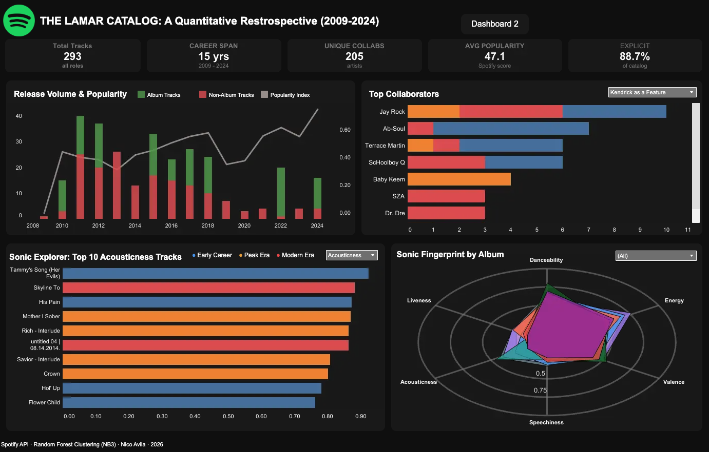
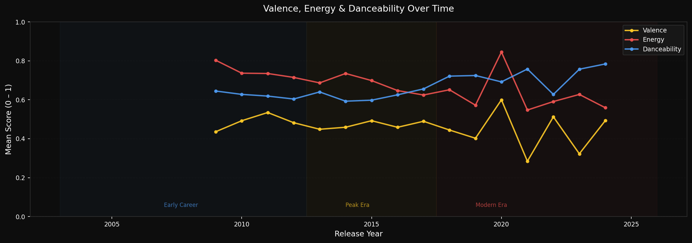

# The Lamar Catalog: Sonic & Partnership Analytics 

**2026**

An end-to-end data pipeline, clustering model, and interactive Tableau dashboard analyzing 15 years of Kendrick Lamar's discography.

## The Challenge
Catalog and partnership decisions in the music industry are historically intuition-driven. Without a structured analytical framework, predicting which track characteristics actually drive streaming performance—or whether strategic collaborations mathematically outperform solo releases—is entirely guesswork. I wanted to replace that guesswork with hard data, using Kendrick Lamar’s complete 15-year discography as the analytical subject.

## The Solution
I engineered a unified Spotify API extraction pipeline to pull 15 years of raw catalog data. From there, I applied K-Means clustering to map out the distinct sonic fingerprints of the music, and trained a Random Forest model to predict catalog popularity based on those underlying audio features. 

Ultimately, I transformed these complex machine learning outputs into two interactive, executive-ready Tableau dashboards. This bridged the gap between the raw algorithmic data and a seamless, dark-themed visual experience, turning 293 tracks and 205 unique collaborations into highly digestible insights.

### Key Technical Implementations:
* **API Extraction & Pipeline Resilience:** Ingested the catalog using a hybrid Spotify API system. Mid-project, Spotify abruptly deprecated their public audio features endpoint. Instead of reducing the project scope, I built a historical data recovery strategy, merging live metadata with pre-deprecation audio vectors using a multi-pass fuzzy matching system (Gestalt pattern matching > 0.85).
* **Feature Engineering:** Having a natural ear for track architecture makes a massive difference when structuring audio data. I engineered composite features like `sonic_darkness` (emotional weight index) and `lyrical_density` (verse output proxy) to translate raw audio metrics into quantifiable, interpretable signals.
* **K-Means Clustering:** Grouped the catalog into interpretable sonic profiles. While silhouette scores identified `k=5` as mathematically optimal, I tuned the thresholds to group them into 3 distinct, audience-readable labels—prioritizing stakeholder communication without sacrificing mathematical rigor.

* **Predictive Modeling:** Built a Random Forest model to predict track popularity across 19 features. To handle the severe temporal imbalance of music releases, I utilized `StratifiedKFold(stratify=era)`, correcting an initially failing cross-validation score into a robust predictive model.

## Key Analytical Insights

### 1. Sonic Evolution is Measurable and Directional
Across 15 years, Kendrick's catalog energy dropped 11.7 points while danceability rose 9.8 points. Valence (musical positivity) declined monotonically across all three defined career eras. Interestingly, his most commercially successful era is mathematically his most emotionally subdued.

### 2. Popularity is Structurally Determined
Audio features alone explain less than 15% of popularity variance. When structural features are added (release year, lead vs. feature role, album placement), the model explains 49% of the variance (RF Test R² 0.487), beating the mean baseline by 39%. Release year is the dominant predictor—the streaming algorithm rewards catalog recency, not sonic profile.

### 3. Feature & Collaboration Trends
* **Top Collaborators:** Mapped out the most frequent guest appearances across the entire discography. The data clearly isolates the TDE (Top Dawg Entertainment) nucleus—with Jay Rock, Ab-Soul, and ScHoolboy Q dominating the top spots. This visualizes the specific core network of labelmates and heavy hitters that helped shape his overarching sound.

## The Impact
This project demonstrates the ability to manage a full data lifecycle under shifting technical constraints. By standardizing chaotic audio metadata and publishing a 25-sheet optimized data source directly into Tableau Public, I transformed raw API JSON into an interactive, zero-jargon intelligence tool that any A&R executive or catalog manager could immediately use to drive partnership strategy. 

## Links & Resources
* 

* 

* 