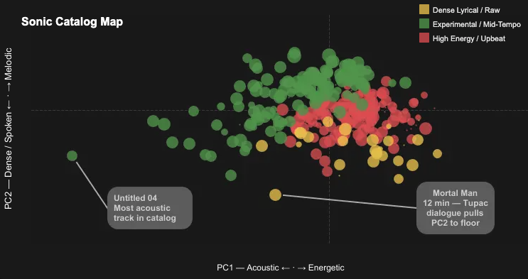
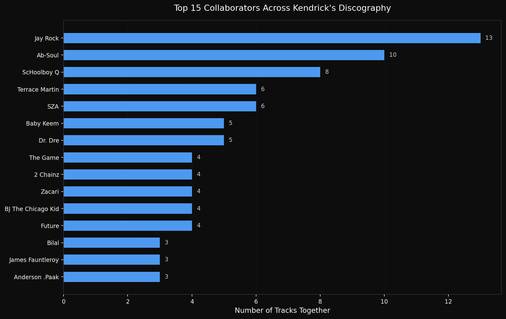

# Kendrick Lamar Discography Analysis

**2026**

## The Question

A question with no business value that I wanted answered anyway: does an artist's catalog cluster into distinct eras, and can you find them in the audio features?

Fifteen years of Kendrick Lamar's discography is a good test case — long enough to have real periods, coherent enough that the periods should be detectable, and something I already knew well enough by ear to sanity-check whatever the clustering claimed.

## The Approach

Spotify API extraction, feature engineering, K-Means clustering, and a Tableau dashboard.

### Key Technical Implementations

* **API Extraction & Pipeline Resilience:** Ingested the catalog using a hybrid Spotify API system. Mid-project, Spotify abruptly deprecated their public audio features endpoint. Rather than reduce scope, I built a historical data recovery strategy, merging live metadata with pre-deprecation audio vectors using a multi-pass fuzzy matching system (Gestalt pattern matching > 0.85).
* **Feature Engineering:** Having a natural ear for track architecture makes a difference when structuring audio data. I engineered composite features like `sonic_darkness` (emotional weight index) and `lyrical_density` (verse output proxy) to translate raw audio metrics into quantifiable, interpretable signals.
* **K-Means Clustering:** Grouped the catalog into interpretable sonic profiles. Silhouette scores identified `k=5` as mathematically optimal, but I tuned the thresholds down to 3 readable labels — the extra two clusters were real and not explainable, which is a bad trade for something meant to be looked at.

* **Predictive Modeling:** Built a Random Forest model to predict track popularity across 19 features. To handle the severe temporal imbalance of music releases, I used `StratifiedKFold(stratify=era)`, correcting an initially failing cross-validation score into a robust model.

## What I Found

### 1. Sonic evolution is measurable and directional

Across 15 years, catalog energy dropped 11.7 points while danceability rose 9.8. Valence — musical positivity — declined monotonically across all three defined eras. His most commercially successful era is mathematically his most emotionally subdued.

### 2. Popularity is structurally determined, not sonically

This was the answer I did not expect. Audio features alone explain less than 15% of popularity variance. Add structural features — release year, lead vs. feature role, album placement — and the model explains 49% (RF Test R² 0.487), beating the mean baseline by 39%.

Release year is the dominant predictor. The streaming algorithm rewards catalog recency, not sonic profile. Which means the thing I set out to measure turned out to be mostly *not* what drives the outcome — a useful result, and not the one I was hoping for.

### 3. The collaboration network is a closed nucleus

Mapping guest appearances across the discography isolates the TDE core — Jay Rock, Ab-Soul, and ScHoolboy Q dominate. The sound has a small, consistent set of contributors behind it.

## Why It's Here

It answered the question, and the answer was more interesting than the one I went looking for. The transferable part is the middle: standardizing messy metadata, recovering a dataset after an API disappeared underneath it, and choosing a cluster count for legibility rather than for the silhouette score.

## Links & Resources

* 

* 

* 
